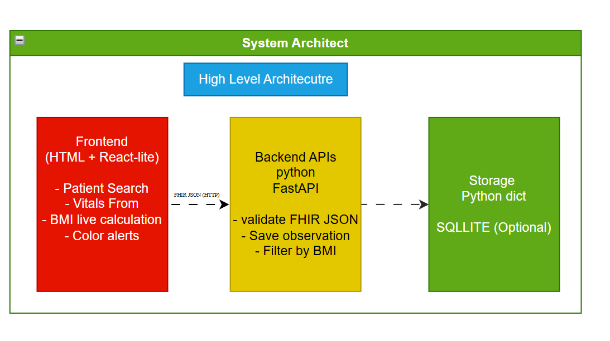
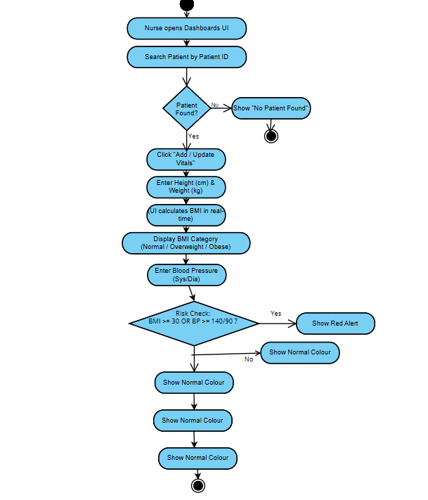
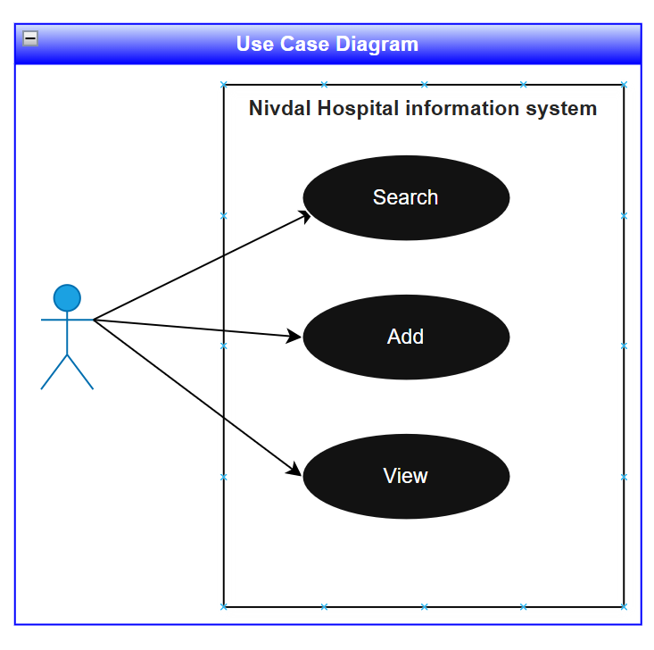
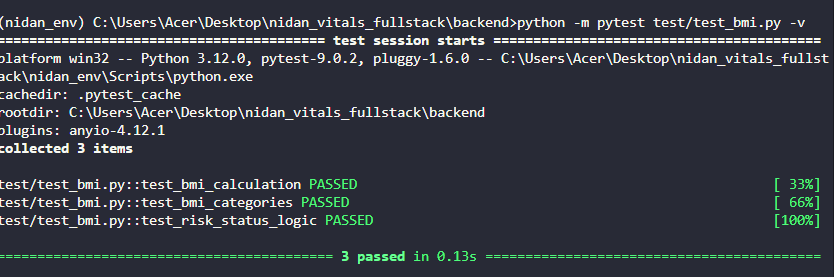

# Nidan Vitals - Full-Stack Vitals Dashboards

### A full-stack clinical vitals management system designed for nurses to record patient observations, calculate real-time BMI, and assess clinical risk status using international healthcare standards.

### Key Features

- FHIR R4 Standard: Data is structured as FHIR Observation resources, ensuring  interoperability.
- Real-time Clinical Logic: Instant BMI calculation and category assessment (WHO Standards).
- Risk Stratification: Automated risk status (Normal, Warning, High Risk) based on combined BMI and Blood Pressure metrics.
- Advanced Filtering: Search by Patient ID and filter the registry by clinical risk levels.
- Automated Testing: 100% test coverage for API endpoints and clinical services.

### Tech Stack
- Backend: Python 3.12, FastAPI (High-performance API framework).
- Frontend: HTML5, Bootstrap 5 (Responsive UI), Vanilla JavaScript.
- Testing: Pytest (Unit and Integration testing).
- Standards: HL7 FHIR R4.

## Technical Design

To ensure the system meets clinical requirements and technical scalability, the following diagrams were developed:

### 1. System Architecture
The application follows a **Decoupled Client-Server Architecture**. The FastAPI backend acts as the "Source of Truth," managing FHIR data and clinical logic, while the Frontend handles real-time user interactions.



### 2. Activity Diagram (Observation Flow)
This diagram illustrates the process from data entry by the nurse to BMI calculation and risk assessment storage.



### 3. Use Case Diagram
Describes the interactions between the **Nurse (User)** and the **Nidan System**, including recording vitals, searching records, and filtering by risk level.




### Folder Structure
```
|---- frontend/
|---- docs/
|---- backend/
|---- nidan_env
|---- .gitignore
|---- README.md
|---- requirements.txt
```

## Installation & Setup

### Frontend
See the frontend setup guide here:  
[Frontend README](./frontend/README.md)

---
### Backend
See the backend setup guide here:  
[Backend README](./backend/README.md)


## Demo

A short demo video showing vitals entry, live BMI calculation, and filtering:

**Watch the Demo here:** [https://youtu.be/8RqNG1_WN6U]

### Testing
The project includes a robust testing suite to ensure clinical accuracy. To run the tests, execute the following in the backend directory:
```bash
python -m pytest test\test_api.py -v
```



### Clinical Logic Implementation
- BMI Calculation:
$$
BMI = \frac{\text{Weight (kg)}}{(\text{Height (cm)} / 100)^2}
$$
                                OR 
$$
BMI = \frac{Weight (kg)}{Height (m)^2}
$$
- Categories: * < 18.5: Underweight 18.5 - 24.9: Normal 25.0 - 29.9: Overweight≥ 30.0: Obese
- Risk Assessment: Combines BMI category with Blood Pressure (Systolic/Diastolic) to flag patients requiring immediate clinical attention.


### Assumptions & Decisions
- In-Memory Storage: For this prototype, a Singleton In-Memory database was used for high-speed performance and simplicity.
- CORS: Enabled to allow the frontend to communicate with the FastAPI backend during local development.
- Validation: Used FastAPI's type hinting and Pydantic-style validation to ensure incoming FHIR JSONs are well-formed.